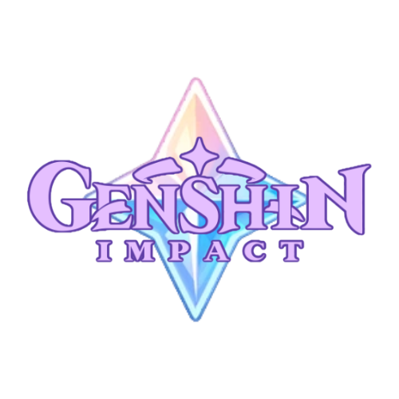

# Li23 Novales & Li30 Yap: CS3 Project Proposal 
## Teyvat's Seven: _Genshin Impact and its World Building_
Note: "Teyvat's Seven" is the main title of the webpage.

**Logo:**

## FINAL MODIFICATION PROPOSAL
<small>note: Create and Read should already be implemented, but since we failed to do so, we'll clarify how exactly we meant to implement it in the final project.</small>
Our plan for implementing full CRUD into the website would be the following:

### Create
LocalStorage items will be created to store the user score for each quiz (MulCho, FillBlanks, GTC).

### Read
These items will then be retrieved and shown at the end of each quiz.

### Update
The high score stored in localStorage will be updated and replaced with the new High Score if the user's current score is higher than their previous one.

### Delete
The user can choose to permanently delete their saved high score if they press the delete button. A pop up will show up before the user deletes the saved data to ensure no accidental data deletion happens.

#### _Updated wireframe showcasing how U and D will be implemented_

## Description
This website is a fan-made collection of pages discussing the lore about the seven nations of Teyvat, the main world in Genshin Impact. This includes important characters and events in the nation, the main element of the nation, a brief overview of the history, and the enemies you can find there as well. There are also fun quizzes you can answer about certain aspects of the lore or of a certain nation, just to tickle your brain, or for die hard Genshin enthusiasts.

## Website Outline and Wireframes

**Homepage:** 
This webpage is the main page, which lets the user navigate to four other pages, _About_, _Nations_, _Quizzes_, and _Sources_.

**About:** 
This webpage will display a description of Genshin Impact, the game developers, when it was made, and its latest update. It will also display a short introduction of the company who made the game.

**Nations:**
This webpage displays a menu that allows users to navigate to the different sub-webpages of the seven regions in Teyvat. This means that there will be _seven more_ sub-webpages showing these nations. To enumerate, these are the seven regions of Teyvat: Mondstadt, Liyue, Inazuma, Sumeru, Fontaine, Natlan, and Snezhaya. For all nation sub-webpages, a general format is described below.

_General Format for each Region Sub-Webpage:_ 
Each region sub-webpage will contain a photo gallery of playable characters important to the nation, and a short description of their backstory, importance, and main weapon when you click on the picture. It will also contain a brief history of the region, and its state at the time that the traveller and Paimon arrive. Since each nation all have signature elements, a description of the main element and its uses will also be in the sub-webpage. The map of the area will be shown, and there will be waypoints that you can click that show a description of an important event that happened in the location of the waypoint. These click-to-reveal information bits will be implemented using Javascript. However, for the sub-webpage of the region Snezhnaya, there will be a hidden code within the information of its region highlighted in bold lettering. When pieced together, the bold letters will forn a secret password that the user can input into a box at the end of the page that will reveal extra hidden info on the lore of the harbingers of the nation.

_The Fatui Secret Password Webpage:_
This is a fun secret that the users can play around with and also serves as a kind of easter egg for Genshin Lore enthusiasts. This will include the implementation of HTML forms in the form of a password type input. The link to the "secret" webpage will only be located in the Snezhnaya Nation Sub-webpage. Certain words and letters will be highlighted in the main paragraph of Snezhnaya, and these words/letters will be combined in the order of their appearance to create the password.

Where to Find:

For example, the password here is: "sitportaerostempu"

Appearance:

Appearance when Password is Entered:

**Quizzes** 

This webpage will contain links to sub-webpages containing quizzes about the following categories: Genshin Impact/Teyvat, Nation, and Characters. There will be quiz sub-webpages for each category as well.

_Quiz Sub-webpages: Teyvat General Info & Character Info_

For the answer-check mechanic, Javascript will be used. The user will put their answers in a box or select from options presented on the screen, and when submitted, will be automatically checked for the correct answer. The tally of scores will also be counted via JS code. After the user finishes answering the second quiz, the webpage will have a button near the lower right portion of the page that will ask if they would like to proceed to the next type of quiz, which is the Guess the Character Quiz. If the user chooses to press the button, they will be redirected to a new page with the next qiuz for them to answer. If the user chooses not to, nothing happens and they can exit the page at will using the Back button at the upper portion of the page. 

_Fill in The Blanks Questions:_
These webpages combine the topics of the characters and teyvat. The Fill in the Blanks questions are located in a separate webpage which can be accessed after the multiple choice questions are answered. The user will type in their own answer in the textbox under the question, and then press the Submit button which would appear to be on the lower right side of the text answer button, that is also a part of our implementation of HTML forms in the form of a textbox form. The user input will then be identified by Javascript to automatically check for the correct answer, so the information received from the forms will also be used in this same webpage. The tally of scores will also be gathered using JS code and stored in localStorage to be displayed later.

Format:

Appearance When Answered:

_Quiz Sub-webpages: Guess the Character_

The Guess the Character Quiz will be implemented using an HTML form to collect the answer from the user. The user will be guided with visual and text clues that will help them guess the answer that they will then input into the answer box of the HTML form, and then press the Submit button which would appear to be on the right side of the text answer button, that is also a part of our implementation of HTML forms in the form of a textbox form. The user input will then be identified by Javascript to automatically check for the correct answer, so the information received from the forms will also be used in this same webpage. The tally of scores will also be gathered using JS code and stored in localStorage to be displayed later.

Format:

Appearance When Answered:

Congratulations Screen for all quizzes:

**Sources:** 
This webpage will contain links to the credible reference sources to be used for collecting various genshin impact-related information.

